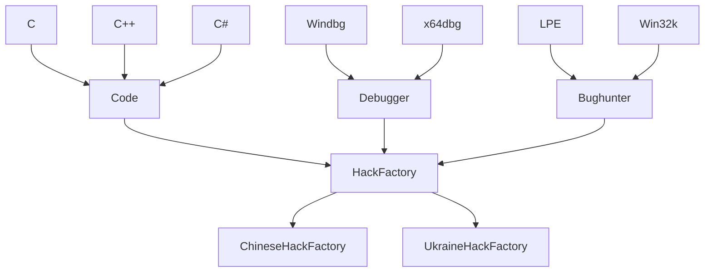

# # 设计模式

## 抽象工厂

> 抽象工厂   简单工厂和工厂方法模式较为简单，抽象工厂是他俩的升级版，适合写框架类的项目。
>
> 个人脑袋不好使，习惯通过画图，理清楚对象与对象之间的关系，以此帮助我梳理更好的选择适合的设计模式。

> 假如有这样的一个需求，我需要生成不同国家 “hacker”之间的技能树
>
> 我是这样分类的，不同的地域 - 不同的对象或者是不同的类。但是他们生产的东西类别是一致的都是黑客技术。
>
> 至于黑客技术我是这样分的，以代码能力，调试能力，挖洞能力具体划分。
>
> 同时代码能力也可以继续分 c/c++, c#,go,java等
>
> ... 挖洞，调试也一样。
>
> 这样简单的图就出来了。

> 明显中间两层工厂都是抽象类，其中HackFactory也可以使用接口，规范生成上面三种抽象类
>
> 我们直接接触的就是 ChineseHackFactory  UkraineHackFactory这两个实例  后续需要扩展什么功能，添加即可。

> ps: 代码没有使用反射，实际情况要复杂的多。
